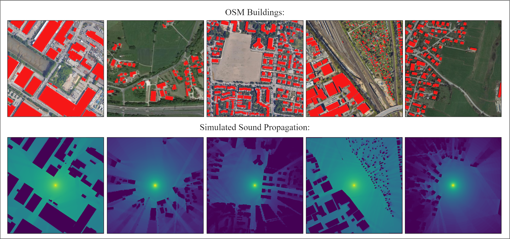
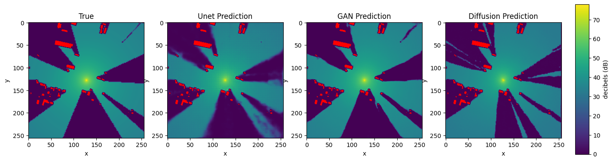
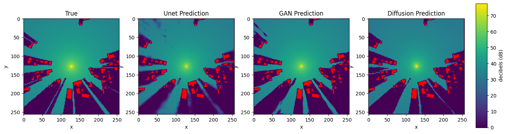
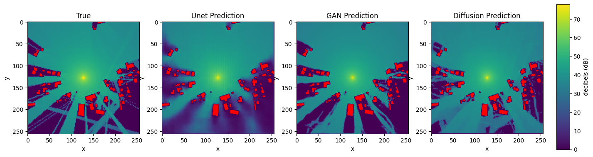
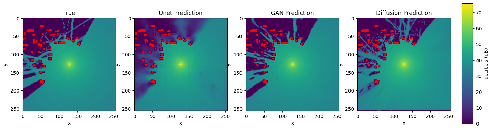

## Abstract

Data-driven modeling of complex physical systems is receiving a growing amount of attention in the simulation and machine learning communities. Since most physical simulations are based on compute-intensive, iterative implementations of differential equation systems, a (partial) replacement with learned, 1-step inference models has the potential for significant speedups in a wide range of application areas. In this context, we present a novel benchmark for the evaluation of 1-step generative learning models in terms of speed and physical correctness.

Our *Urban Sound Propagation* benchmark is based on the physically complex and practically relevant, yet intuitively easy to grasp task of modeling the 2d propagation of waves from a sound source in an urban environment. We provide a dataset with 100k samples, where each sample consists of pairs of real 2d  building maps drawn from *OpenStreetmap*, a parameterized sound source, and a simulated *ground truth* sound propagation for the given scene. The dataset provides four different simulation tasks with increasing complexity regarding reflection, diffraction and source variance. A first baseline evaluation of common generative *U-Net, GAN* and *Diffusion* models shows, that while these models are very well capable of modeling sound propagations in simple cases, the approximation of sub-systems represented by higher order equations systematically fails.

## Dataset Description

This dataset is assembled for research into urban sound propagation, comprising 25,000 data points across 10 diverse cities. Each city is represented by 2,500 locations, offering a comprehensive analysis of various urban configurations. The dataset utilizes OpenStreetMap (OSM) imagery to detail the urban layout within a 500m x 500m area for each location, where buildings are delineated with black pixels and open spaces with white pixels.




Supplementing the urban structural images, the dataset includes sound distribution maps at resolutions of 512x512 and 256x256. These maps are precisely generated through the [NoiseModelling v4.0](https://github.com/Universite-Gustave-Eiffel/NoiseModelling) framework, an advanced simulation tool engineered for accurate modeling of sound dynamics within urban environments.

The data collection methodology involves sourcing information via the Overpass API, subsequently refined and verified using GeoPandas to ensure the dataset's integrity and consistency. For researchers and experts interested in exploring the intricacies of sound simulation, additional insights can be obtained from the NoiseModelling framework [documentation](https://noisemodelling.readthedocs.io/en/latest/).

Additionaly, a comprehensive description of the dataset is given as a [Datacard](https://github.com/urban-sound-data/urban-sound-data/blob/main/documentation/datacard.pdf).


## Download Dataset

The dataset used for evaluation is publicly available and published via Zenodo, ensuring easy access and reproducibility of our research findings [](https://doi.org/10.5281/zenodo.10609793).

## Code for baseline experiments
The code is located at the [GitHub repository](https://github.com/urban-sound-data/urban-sound-data).

This script evaluates the accuracy of predicted sound propagation against true data using metrics such as Mean Absolute Error (MAE) and Mean Absolute Percentage Error (MAPE), with special consideration for visibility based on Open Street Map data.

```
project_root/
│
├── data/                         # Dedicated data folder
│   └── urban_sound_25k_baseline/ # download this via provided DOI
│       ├── test/
│       │   ├── test.csv
│       │   ├── soundmaps/
│       │   └── buildings/
│       │
│       └── pred/                 # your predictions
│           ├── y_0.png
│           └── ...
│
└── calc_test_metrics.py
```

The indexing system for predicted sound propagation images in the pred folder aligns directly with the test.csv dataframe rows. Each predicted image file, named as y_{index}.png, corresponds to the test data's row at the same index, with index 0 referring to the dataframe's first row. 

### Running the Script

To run the evaluation, navigate to your project's root directory and execute the evaluate.py script with the required arguments:

```bash
python evaluate.py --data_dir data/true --pred_dir data/pred --output results/evaluation.csv
```
- data_dir: Path to the directory containing true labels and OSM images.
- pred_dir: Path to the directory containing predicted sound maps.
- output: Desired path for the output CSV file containing evaluation results.

### Understanding the Output

The script generates an evaluation.csv file with the following columns:

- sample_id: Unique identifier for each sample.
- MAE: Mean Absolute Error across the entire sound map.
- wMAPE: weighted Mean Absolute Percentage Error across the entire sound map.
- LoS_MAE: MAE for areas in sight of the sound source, based on OSM data.
- NLoS_MAE: MAE for areas not in sight of the sound source.
- LoS_wMAPE: weighted MAPE for areas in sight of the sound source.
- NLoS_wMAPE: weighted MAPE for areas not in sight of the sound source.

After running the script, you can find summary statistics in the console output, providing an overview of the evaluation metrics across all samples.

## Baseline Results

The table below presents baseline performance metrics for various architectural approaches, encompassing combined mean absolute error (MAE) and weighted mean absolute percentage error (wMAPE), alongside specific line-of-sight (LoS) and non-line-of-sight (NLoS) metrics. 

| Condition   | Architecture | MAE | wMAPE | LoS MAE | NLoS MAE | LoS wMAPE | NLoS wMAPE |
|-------------|--------------|--------------|----------------|---------|----------|-----------|------------|
| Baseline    | UNet         | 2.08         | 19.45          | 2.29    | 1.73     | 12.91     | 37.57      |
| Baseline    | GAN          | **1.52**         | **8.21**           | **1.73**    | **1.19**     | **9.36**      | **6.75**       |
| Baseline    | Diffusion    | 2.57         | 25.21          | 2.42    | 3.26     | 15.57     | 51.08      |
|             |              |                 |                 |                |                |                |                |
| Diffraction | UNet         | **1.65**         | 9.75           | 0.94    | **3.27**     | 4.22      | 22.36      |
| Diffraction | GAN          | 1.66         | **8.03**           | **0.91**    | 3.36     | **3.51**      | **18.06**      |
| Diffraction | Diffusion    | 2.12         | 11.85          | 1.59    | **3.27**     | 8.25      | 20.30      |
|             |              |                 |                 |                |                |                |                |
| Reflection  | UNet         | 3.22         | 31.87          | 2.29    | 5.72     | 12.75     | 80.46      |
| Reflection  | GAN          | **2.88**         | **16.57**          | **2.14**    | **4.79**     | **11.30**     | **30.67**      |
| Reflection  | Diffusion    | 4.14         | 35.20          | 2.74    | 7.93     | 17.85     | 80.38      |
|             |              |                 |                 |                |                |                |                |
| Combined    | UNet         | 1.77         | 20.59          | 1.39    | 2.63     | 10.10      | 45.15      |
| Combined    | GAN          | 1.76         | **19.12**          | 1.37    | 2.67     | **9.80**      | 40.68      |
| Combined    | Diffusion    | **1.57**         | 21.45          | **1.26**    | **2.21**     | 13.07     | **40.38**      |

### Example Showcase:
The following figures illustrate test set samples, showcasing the predictive outcomes from the U-Net, GAN, and diffusion model alongside the actual label for comparison.

#### Baseline scenario:



#### Reflection scenario:




## License
This dataset is licensed under a [Creative Commons Attribution-NonCommercial-NoDerivatives 4.0 International](https://creativecommons.org/licenses/by-nc-nd/4.0/)
